# Recolouring photographs using restricted colour palettes

## Introduction

This experiment follows [a tweet by
@jimblimey](https://twitter.com/jimblimey/status/1425211035993223171)
where he recolours images for old computers with restricted colour
palettes.  He is interested in two particular palettes, [ZX
Spectrum](https://en.wikipedia.org/wiki/ZX_Spectrum_graphic_modes)
(the colour palette used on the original Sinclair ZX Spectrum home computer) and
Spectra, (the colour palette used in the [SPECTRA
interface](http://www.fruitcake.plus.com/Sinclair/Spectrum/Spectra/SpectraInterface.htm))
(Figures 1 and 2). @jimblimey's algorithm uses Euclidean distance
between points in RGB colour space to find the nearest
colour. However, the RGB colour space is not perceptually uniform. I
wanted to see if better results could be obtained using colour
distance measures in an approximately perceptually uniform colour
space.

Figure 1. The ZX Spectrum colour scheme.

Figure 2. The Spectra colour scheme.

# Method

I used the [Julia programming language](https://julialang.org/), the
[Images.jl library](https://github.com/JuliaImages/Images.jl), the
[ColorSchemes.jl
library](https://github.com/JuliaGraphics/ColorSchemes.jl) and the
colour distance metrics implemented in the [Colors.jl
library](https://github.com/JuliaGraphics/Colors.jl).

I used the ZX Spectrum and Spectra colour schemes.

I implemented nearest colour using both RGB Euclidean distance and the
CIEDE2000 metric [1], comparing results.

# Results

  

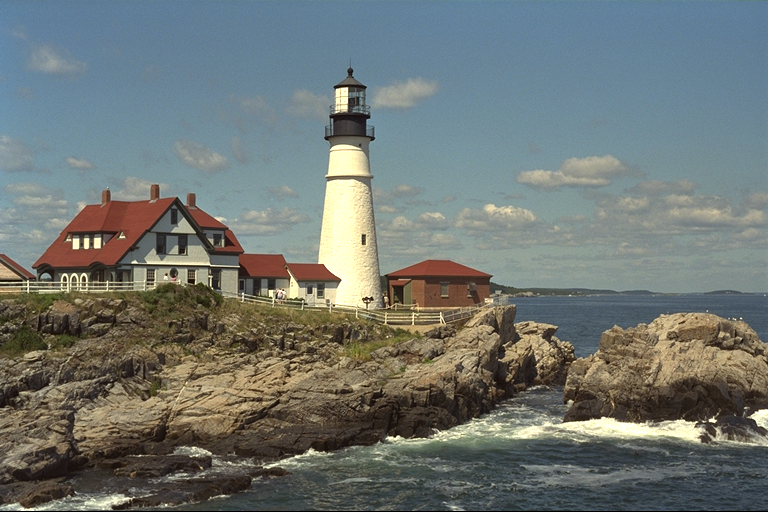 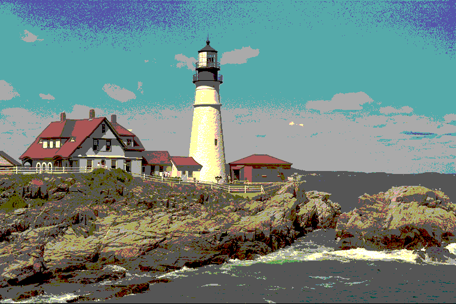 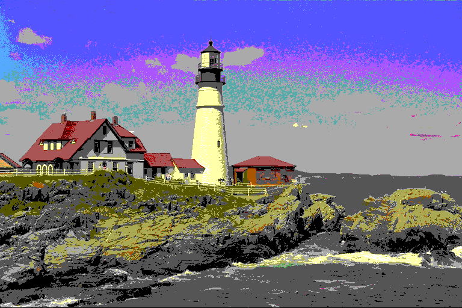

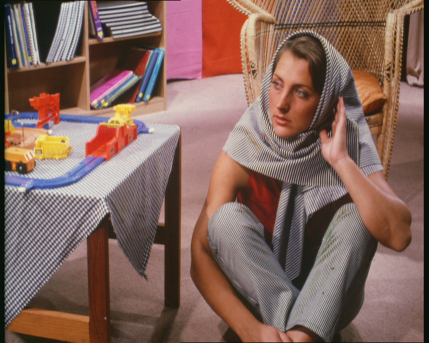 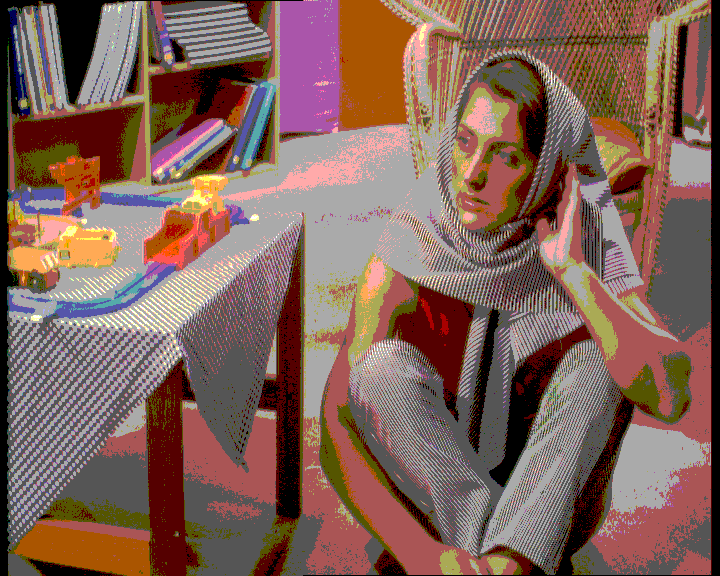 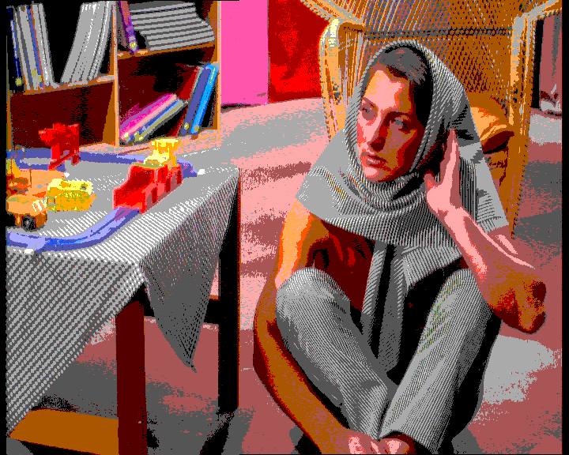

 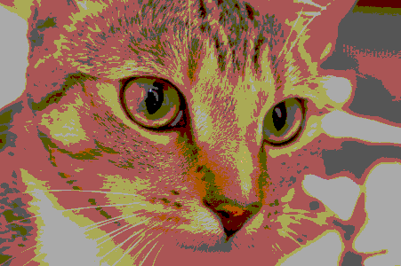 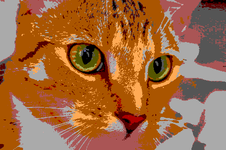

Figure 1. Various images recoloured using the Spectra colour
scheme. The first column is the original image, the second column is
the recoloured image using Euclidean distance in RGB space, and the
third column is the recoloured image using CIEDE2000 colour distance.

  

 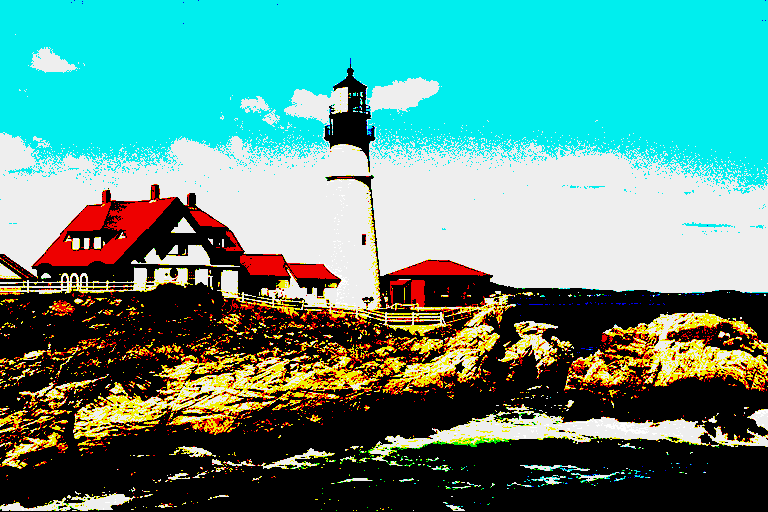 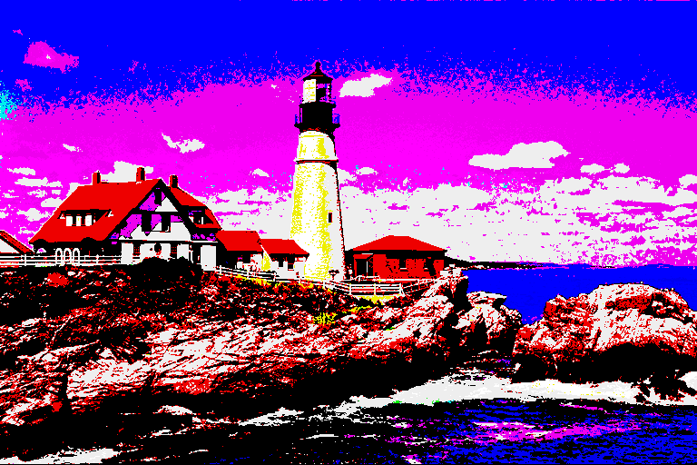

 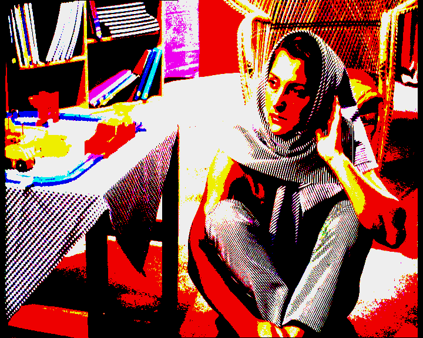 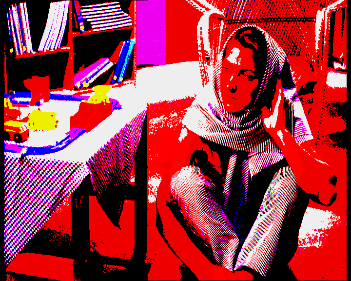

 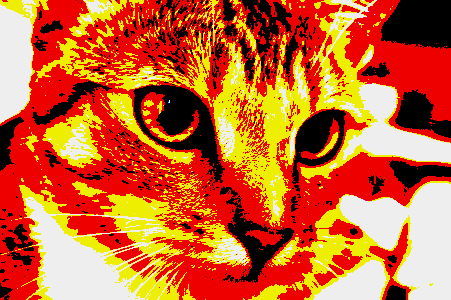 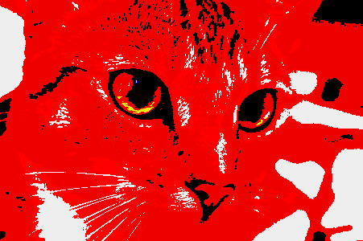

Figure 2. Various images recoloured using the ZX Spectrum colour
scheme.  The first column is the original image, the second column is
the recoloured image using Euclidean distance in RGB space, and the
third column is the recoloured image using CIEDE2000 colour distance.

# Discussion

The faces shown in Figure 1 arguably look more natural when rendered
using CIEDE2000 colour distance than Euclidean RGB. The greens in the
face of Tony Blair look particularly out of place. The human vision
system is known to be very sensitive to the colouring of human faces
[2]

The ZX Spectrum colour map is highly constrained, and all the results
shown in Figure 2 obscure detail. This color scheme is similar to
so-called rainbow colour maps which have been shown to be problematic
for rendering scientific figures [3]. The RGB Euclidean images make
more use of yellow and it is an open question as to whether this is
qualitatively better or worse.

There is a large literature on image processing and recolouring of
photographic images which I have not studied in detail. It may be
possible to use dithering to improve the rendition of photographs
using restricted colour palettes.

# Conclusions

It may be beneficial to use the CIEDE2000 colour distance metric when
determining nearest colours for photographic recolouring, especially when
the content includes faces.

# Acknowledgements

The image of Tony Blair, adapted for our experiments, is courtesy of
the World Affairs Council and is licensed under the terms of the
Creative Commons Attribution 2.0 Generic license.

# References

[1]: Witt K. 2007., CIE color difference metrics. In Colorimetry:
Understanding the CIE System , pp. 79–100. Ed. by
J. Schanda. Wiley-Blackwell, Oxford, UK.

[2]: Rogowitz B. E., Kalvin A. D., 2001. The Which Blair project: a quick
visual method for evaluating perceptual color maps. In Proceedings of
the conference on visualization’01, pp. 183–190. IEEE Computer
Society, Washington DC, USA.

[3]: Borland D., Ii R. M. T., 2007. Rainbow color map (still) considered
harmful . IEEE Computer Graphics and Applications, 27: 14–17.
